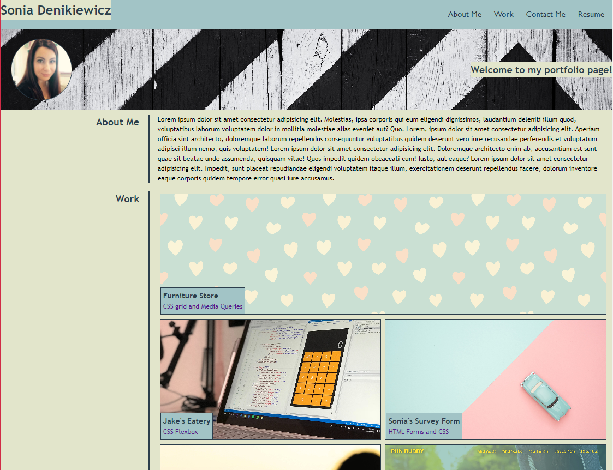

# Portfolio Page - Bootcamp Week 2

## A responsive portfolio page using CSS grid and flexbox 

This page has been created as a portfolio that can be updated as I progress through the bootcamp to showcase what I have learned. It provides links to 5 projects with one being the most important and highlighted at the top of the "work" section being double the size of the others. In order to make the page responsive, CSS flexbox and grid have been used, along with media queries at specific breakpoints.

## Usage

Here is a mock up of the page:
    
  

## Credits

[Assignment] https://courses.bootcampspot.com/courses/3021/assignments/44735?module_item_id=832140

[FreeCodeCamp] https://www.freecodecamp.org/learn/2022/responsive-web-design/build-a-survey-form-project/build-a-survey-form

[Odin Project] https://www.theodinproject.com/lessons/foundations-recipes

## Badges

